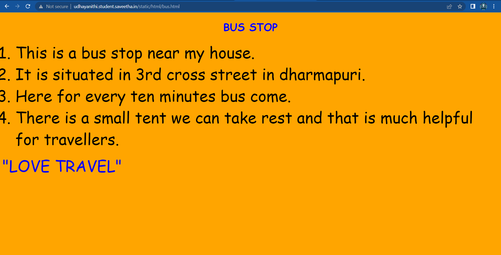
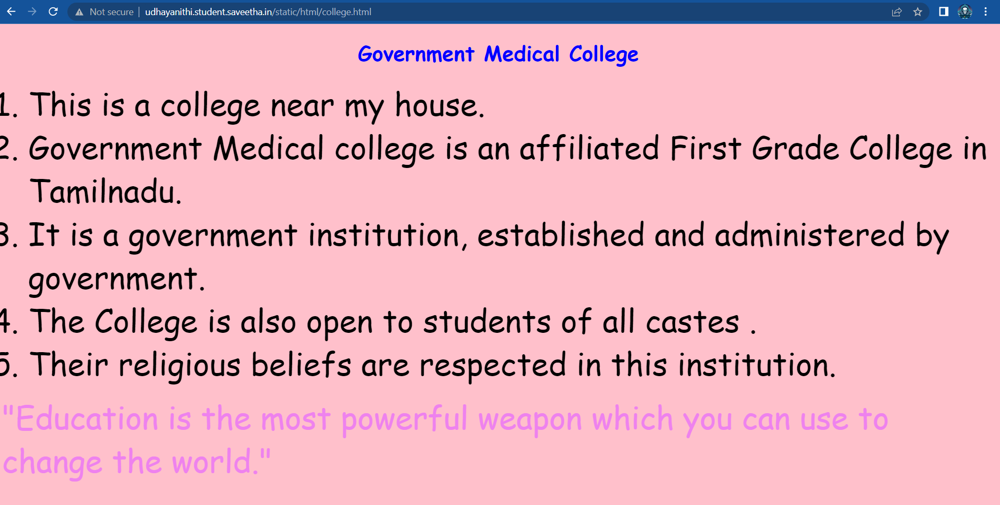
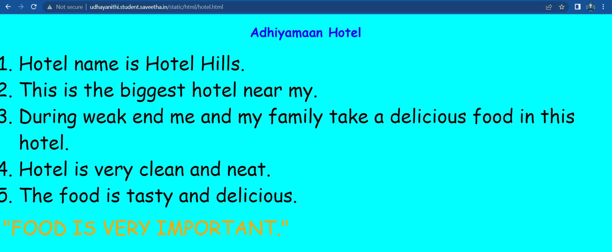
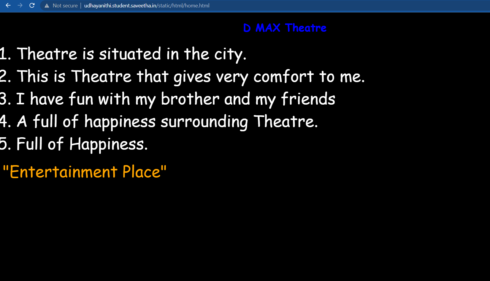
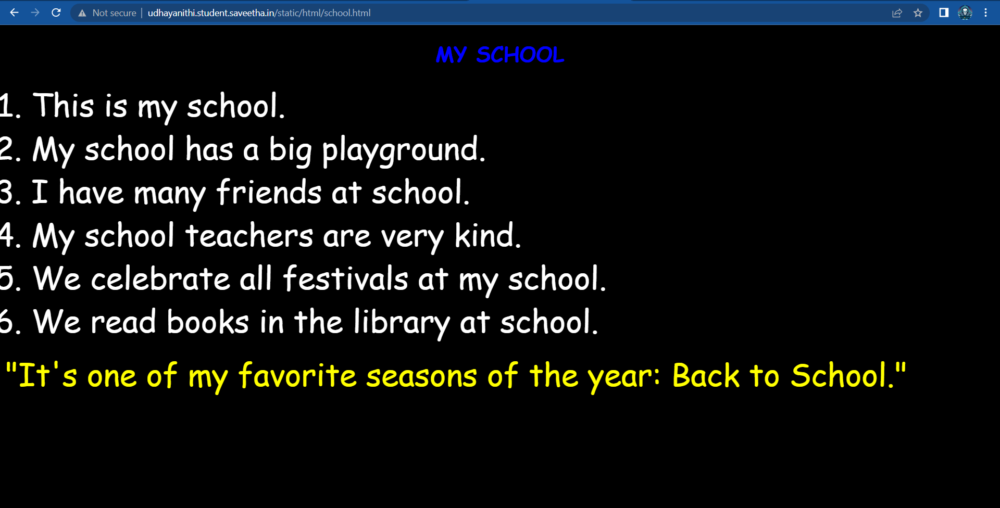
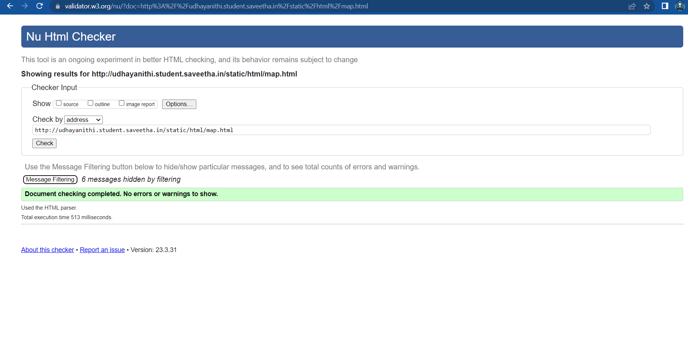

# Places Around Me
## AIM:
To develop a website to display details about the places around my house.

## Design Steps:

### Step 1:
clone the github repository into theia IDE

### Step 2:
create a new django project.

### step 3:
write the needed HTML code

### step 4:
Run the Django server and execute the HTML files

## Code:
```
map.html

<!DOCTYPE html>
<html lang="en">
    <head>
        <title>MAT MAP</title>
    </head>
    <body>
        
        <MAP name="map2">
             <AREA shape="RECT" coords="1180,188,1213,172"
                   href = "/static/html/bus.html" Title="bus stand" alt>
             <AREA shape="RECT" coords="851,951,871,910"
                   href = "/static/html/college.html" Title="college" alt>
             <AREA shape="RECT" coords="990,667,1008,660"
                   href = "/static/html/school.html" Title="school" alt>
             <AREA shape="RECT"  coords="1075,265,1100,258"
                   href = "/static/html/home.html"   Title="theatre" alt>
             <AREA shape="RECT"  coords="1272,167,1294,160"
                   href = "/static/html/hotel.html"  Title="hotel" alt>
         
        </MAP>

    </body>
</html>

bus.html

<!DOCTYPE html>
<html lang="en">
<head>
    <title>
        HI-TECH BUS STOP
    </title>
</head>
<body bgcolor="orange" >
<h1 align="center">
    <font color="blue" face="cursive">
        BUS STOP
    </font>
</h1>
<p align="center">
    <font color="black" face="Comic Sans MS" size="24">
        <OL  TYPE="1" START="1">
            <LI> This is a bus stop near my house.<br></LI> 
            <LI>It is situated in 3rd cross street in dharmapuri.<br></LI>   
            <LI>Here for every ten minutes bus come.<br></LI>
            <LI>There is a small tent we can take rest and that is much helpful for travellers.<br></LI>
        </OL>
    </font>
    <font color ="blue" face = "cursive" size="16" > 
    "LOVE TRAVEL"
    </font>
</p>
</body>
</html>

hotel.html

<!DOCTYPE html>
<html>
<head>
    <title>
        HOTEL
    </title>
</head>
<body bgcolor="cyan">
<h1 align="center">
    <font color="blue" face="cursive">
        Jooly Biryani
    </font>
</h1>
<p align="center">
    <font color="black" face="Comic Sans MS" size="24">
        <OL  TYPE="1" START="1">
            <LI> Hotel name is Jooly Biryani.<br></LI> 
            <LI>This is the biggest hotel near my.<br></LI>   
            <LI>During weak end me and my family take a delicious food in this hotel.<br></LI>
            <LI>Hotel is very clean and neat.<br></LI>
            <LI>The food is tasty and delicious.<br></LI>
        </OL>
    </font>
    <font color ="orange" face = "cursive" size="16" > 
    "FOOD IS VERY IMPORTANT."
    </font>
</p>
</body>
</html>

Theatre.html

<!DOCTYPE html>
<html lang="en">
<head>
    <title>
        Theatre
    </title>
</head>
<body bgcolor="black">
<h1 align="center">
    <font color="blue" face="cursive">
        D MAX Theatre
    </font>
</h1>
<p align="center">
    <font color="white" face="Comic Sans MS" size="24">
        <OL  TYPE="1" START="1">
            <LI> Theatre is situated in the city.<br></LI> 
            <LI>This is Theatre that gives very comfort to me.<br></LI>   
            <LI> I have fun with my brother and my friends<br></LI>
            <LI>A full of happiness surrounding Theatre.<br></LI>
            <LI>Full of Happiness.<br></LI>
        </OL>
    </font>
    <font color ="orange" face = "cursive" size="16" > 
    "Entertainment Place"
    </font>
</p>
</body>
</html>

school.html

<!DOCTYPE html>
<html lang="en">
<head>
    <title>
        MY SCHOOL
    </title>
</head>
<body bgcolor="black">
<h1 align="center">
    <font color="blue" face="cursive">
        MY SCHOOL
    </font>
</h1>
<p align="center">
    <font color="white" face="Comic Sans MS" size="24">
        <OL  TYPE="1" START="1">
            <LI> This is my school.<br></LI> 
            <LI>My school has a big playground.<br></LI>   
            <LI>I have many friends at school.<br></LI>
            <LI>My school teachers are very kind.<br></LI>
            <LI>We celebrate all festivals at my school.<br></LI>
            <LI>We read books in the library at school.<br></LI>
        </OL>
    </font>
    <font color ="yellow" face = "cursive" size="16" > 
    "It's one of my favorite seasons of the year: Back to School."
    </font>
</p>
</body>
</html>

college.html

<!DOCTYPE html>
<html lang="en">
<head>
    <title>
        COLLEGE
    </title>
</head>
<body bgcolor="pink">
<h1 align="center">
    <font color="blue" face="cursive">
        Government Medical College
    </font>
</h1>
<p align="center">
    <font color="black" face="Comic Sans MS" size="24">
        <OL  TYPE="1" START="1">
            <LI>This is a college near my house.<br></LI> 
            <LI>Government Medical college  is an affiliated First Grade College in Tamilnadu.<br></LI>   
            <LI>It is a government institution, established and administered by government.<br></LI>
            <LI>The College is also open to students of all castes .<br></LI>
            <LI> Their religious beliefs are respected in this institution.<br></LI>
        </OL>
    </font>
    <font color ="violet" face = "cursive" size="16" > 
    "Education is the most powerful weapon which you can use to change the world."
    </font>
</p>
</body>
</html>
```


## Output:












## HTML Validator



## Result:
The program for implementing image map is executed successfully
